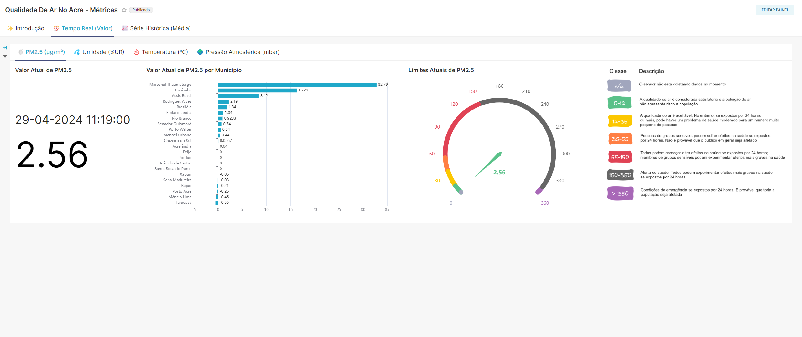
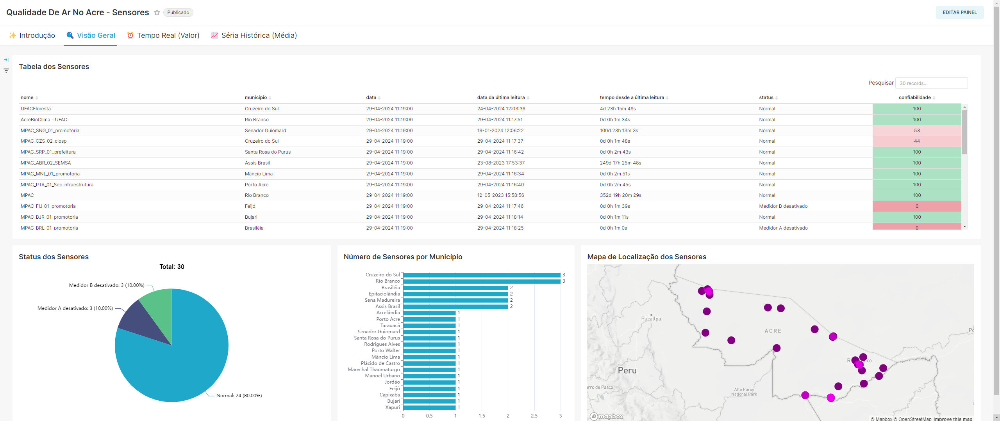
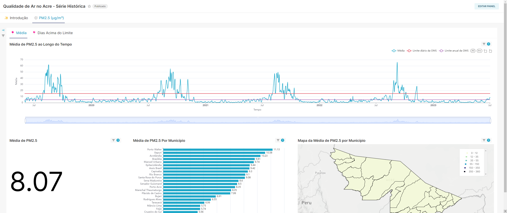

<h1 align="center">
  <span> 📊 Solução de IoT Analytics - TCC </span>
  <h3 align="center">
    <i> Ciência da Computação - UFCG</i>
  </h3>
</h1>

> Para mais detalhes sobre a solução, acesse o [TCC]().

## 📑 Sumário

- [Descrição](#descricao)
- [Arquitetura](#arquitetura)
  - [Componentes](#componentes)
  - [Conteinerização](#docker)
  - [Fluxos](#fluxos)
- [Execução](#execucao)
- [Licença](#license)

## 📝 Descrição <a name = "descricao"></a>

Solução de IoT Analytics, desenvolvida como parte do Trabalho de Conclusão de Curso (TCC) do curso de Ciência da Computação da Universidade Federal de Campina Grande (UFCG), essa ferramenta foi projetada para trabalhar com sensores ambientais. Seu principal objetivo é coletar, processar, armazenar, analisar e visualizar os dados métricos do ambiente e dos próprios sensores em tempo real, além de permitir análises históricas. Essa solução foi aplicada com sucesso à [rede de sensores de qualidade do ar no estado do Acre](https://www.ufac.br/site/noticias/2023/projeto-desenvolvido-na-ufac-monitora-qualidade-do-ar-no-acre), Brasil. Isso serviu como um teste prático para verificar sua viabilidade e eficácia. 

### 📦 Arquitetura <a name = "arquitetura"></a>
A arquitetura foi meticulosamente projetada seguindo os princípios de uma arquitetura de microsserviços, proporcionando um sistema robusto e flexível, ideal para lidar com os desafios únicos apresentados pelos dados da Internet das Coisas (IoT).

A arquitetura proposta é composta por um conjunto de aplicações, cada uma desempenhando um serviço essencial. As principais aplicações são provenientes da [Fundação Apache](https://www.apache.org/), uma respeitada organização sem fins lucrativos dedicada a apoiar projetos de código aberto. A escolha de utilizar exclusivamente componentes de código aberto permite uma personalização e flexibilidade sem precedentes, permitindo que a arquitetura seja adaptada para atender a uma variedade de necessidades.

Além disso, a arquitetura foi construída para suportar características-chave no contexto de dados da IoT, como interoperabilidade, reutilização e flexibilidade. Isso garante que a arquitetura possa se adaptar e evoluir à medida que novas tecnologias e padrões emergem no campo em rápida evolução da IoT.


#### 🛠️ Componentes  <a name = "componentes"></a>
- [Apache NiFi](https://nifi.apache.org/): Esta aplicação é a responsável pela ingestão de dados em tempo real.
- [Apache Kafka](https://kafka.apache.org/): Esta aplicação é a responsável pelo gerenciamento e distribuição dos diferentes fluxos de dados entre as aplicações.
- [Apache Spark](https://spark.apache.org/): Esta aplicação é a responsável pelo processamento de dados em tempo real.
- [Apache Druid](https://druid.apache.org/): Esta aplicação é a responsável pelo armazenamento e pelas analises de dados em tempo real e em série histórica.
- [Apache Superset](https://superset.apache.org/): Esta aplicação é a responsável pela visualização dos dados em tempo real e em série histórica.
- [Node.js](https://nodejs.org/): Esta aplicação foi utilizada para desenvolver serviços auxiliares que são utilizados pelo Apache NiFi.

#### ✨ Conteinerização <a name = "docker"></a>
Foi utilizado o [Docker](https://www.docker.com/) para empacotar cada aplicação e suas dependências em um recipiente virtual. Cada componente (NiFi, Kafka, Spark, Druid, Superset e os Serviços Node.js) tem um container dedicado, gerenciado por um arquivo Docker Compose. Foi criado um arquio Dockerfile específico para os serviços Node.js, contendo instruções para construir suas respectivas imagens Docker.

Cada container contém apenas os serviços e ferramentas necessários para seu funcionamento. Todos os containers são executados na mesma rede, `iot_analytics`, para permitir a comunicação entre eles. Os volumes de dados para cada aplicação são nomeados para garantir a persistência dos dados ao reiniciar a aplicação.

### ⚙️ Fluxos <a name = "fluxos"></a>

A arquitetura é estruturada em quatro fluxos principais: **Ingestão**, **Processamento**, **Armazenamento** e **Visualização**. Cada fluxo tem uma função específica e é definido como a interação entre duas ou mais aplicações que trabalham em conjunto para alcançar um objetivo específico.

**Fluxos da arquitetura**


>**Ingestão**

No fluxo de ingestão, o Apache NiFi é encarregado de coletar os dados dos sensores da PurpleAir e enviá-los para o Apache Kafka. O Kafka atua num sistema de produtor e consumidor, onde o Apache NiFi atua como produtor.

**Funcionamento do Kafka**


>**Processamento**

No fluxo de processamento, o Apache Kafka disponibiliza os dados brutos para o Apache Spark, especificamente o [Spark Structured Streaming](https://spark.apache.org/docs/latest/structured-streaming-programming-guide.html). O Spark processa esses dados e os envia de volta para o Apache Kafka. Neste cenário, o Apache Spark atua como consumidor e produtor do Apache Kafka.


**Funcionamento do Spark Structured Streaming**


>**Armazenamento**

No fluxo de armazenamento, o Apache Kafka disponibiliza os dados processados para o Apache Druid, que faz a ingestão e o armazenamento desses dados, disponibilizando-os para serem consultados e analisados.

**Funcionamento do Druid**


**Funcionamento da Integração do Kafka com o Druid**


>**Visualização**

No fluxo de visualização, o Apache Druid disponibiliza os dados para o Apache Superset, que permite a visualização dos dados em tempo real e em série histórica. Através dos dashboards, é possível visualizar os dados de qualidade do ar no Acre, entre outras métricas e dados coletados.

**Dashboard de PM2.5 em Tempo Real**


**Dashboard de PM2.5 em Série Histórica**


**Dashboard de Status dos Sensores**


**Dashboard de Dados Históricos**



### 🚀 Execução <a name = "execucao"></a>

Para facilitar a execução do projeto, foi criado um [Makefile](https://makefiletutorial.com/). O Makefile é um arquivo que contém um conjunto de diretivas para compilar e executar um projeto, automatizando tarefas repetitivas e simplificando a execução de comandos.

> **Pré-requisitos**
1. No arquivo Makefile, atribua o nome de usuário do [Docker Hub](https://hub.docker.com/) à variável `DOCKER_USER`. Isso permitirá o envio da imagem modificada do Superset para o Docker Hub.
2. Atribua uma chave de API do [MapBox](https://www.mapbox.com/) à variável `MAPBOX_API_KEY` para permitir a visualização de mapas no Apache Superset. Essa atribuição é feita no arquivo `apps/superset/setup/docker/.env`.
2. Crie a rede `iot_analytics` no Docker usando o comando abaixo:
    ```bash
      make create-network
    ```

> **Configuração para Execução**

1. Criação e execução dos containers das APIs:
    1.1 Geração das imagens das APIs:
    ```bash
      make apis-build
    ```
    1.2 Criação dos containers das APIs:
    ```bash
      make apis-run
    ```
    1.3 Execução dos containers das APIs:
    ```bash
      make apis-start
    ```
2. Geração e utilização da imagem modificada do Superset:
    2.1 Geração da imagem:
    ```bash
      make superset-build
    ```
    2.2 Substitua a imagem do Superset no seu `docker-compose.yml` pela imagem gerada no passo anterior. Este arquivo está localizado em `apps/superset/setup`.

3. Criação e execução dos containers dos APPs:
    ```bash
      make apps-up
    ```
> **Executando**
1. Configuração do Apache Kafka:
    1.1 Crie os tópicos listados abaixo, que são utilizados para os fluxos de dados entre as aplicações. Configure de acordo com sua necessidade, mas recomendo alocar 2 dias para os tópicos do tipo `raw` e 7 dias para os tópicos do tipo `processed`:
      * `raw_air_sensors_data`
      * `raw_air_sensors_historical_data`
      * `processed_air_sensors_status_data`
      * `processed_air_sensors_metrics_data`
      * `processed_air_sensors_historical_data`

2. Configuração do Apache NiFi:
    2.1 Importe os templates localizados em `apps/nifi/src/templates`.
    2.2 Configure o DistributedMapCacheServer e o DistributedMapCacheClientService.
    2.3 Inicie os grupos de processos dos templates importados.

3. Configuração do Apache Spark (execute cada comando em um terminal separado):
    3.1 Inicialize o processamento de dados brutos das métricas captadas pelos sensores:
    ``` bash
    make spark-submit job=process_air_sensors_metrics_data
    ```
    3.2 Inicialize o processamento de dados brutos do status dos sensores:
    ``` bash
    make spark-submit job=process_air_sensors_status_data
    ```
    3.3 Inicialize o processamento de dados históricos dos sensores:
    ``` bash
    make spark-submit job=process_air_sensors_historical_data
    ```
4. Configuração do Apache Druid:
    4.1 Inicialize os processos de ingestão dos dados dos sensores, criando um processo de ingestão para cada `spec` localizado em `apps/druid/src/specs`.

5. Configuração do Apache Superset:
    5.1 Importe os dashboards localizados em `apps/superset/src/dashboards`.

> **Finalizando**
1. Para finalizar a execução dos containers dos APPs:
    ```bash
      make apps-stop
    ```
2. Para finalizar a execução dos containers das APIs:
    ```bash
      make apis-stop
    ```

## 📃 Licença <a name="license"></a>

Esse projeto está sob a licença MIT. Veja o arquivo [LICENSE](LICENSE) para mais detalhes.
